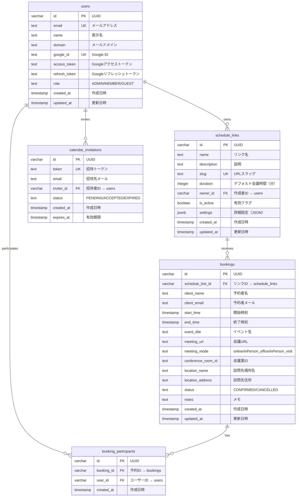

# DB設計書

> IPO と Data 一覧から、効果的なDB設計を作成

## インフラ構成

| 項目 | 技術 |
|------|------|
| DBエンジン | PostgreSQL（Supabase） |
| ORM | Drizzle ORM |
| 認証 | Supabase Auth（Google OAuth）→ パスワードハッシュ不要 |
| 型の利用 | UUID型、JSONB型、配列型が使用可能 |

## テーブル一覧

| テーブル名 | 目的 | 関連データ項目 |
|-----------|------|--------------|
| users | ユーザー情報・Googleトークン管理 | #1〜#10 |
| schedule_links | スケジュールリンクの基本情報 | #11〜#19 |
| bookings | 予約情報 | #31〜#46 |
| booking_participants | 予約参加者（多対多） | #47〜#50 |
| calendar_invitations | カレンダー連携招待 | #51〜#57 |

## ER図



## テーブル詳細

### users

**目的**: ユーザー情報とGoogleトークンを管理する。社内ユーザー（ADMIN/MEMBER）と外部ユーザー（GUEST）を同一テーブルで管理。

| カラム | 型 | 制約 | 説明 |
|-------|-----|------|------|
| id | varchar | PK | UUID。主キー |
| email | text | NOT NULL, UNIQUE | メールアドレス |
| name | text | NOT NULL | 表示名（Googleアカウント名） |
| domain | text | NOT NULL | メールドメイン（boostconsulting.co.jp等） |
| google_id | text | UNIQUE | Google アカウントID |
| access_token | text | | Googleアクセストークン |
| refresh_token | text | | Googleリフレッシュトークン |
| role | text | NOT NULL, DEFAULT 'MEMBER' | 権限（ADMIN / MEMBER / GUEST） |
| created_at | timestamp | NOT NULL, DEFAULT NOW() | 作成日時 |
| updated_at | timestamp | NOT NULL, DEFAULT NOW() | 更新日時 |

**インデックス**:
- `idx_users_email` (email) — ログイン・参加者検索で使用
- `idx_users_domain` (domain) — ドメイン制限チェックで使用

### schedule_links

**目的**: スケジュールリンクの基本情報と設定を管理する。詳細設定はsettings（JSONB）に格納。

| カラム | 型 | 制約 | 説明 |
|-------|-----|------|------|
| id | varchar | PK | UUID。主キー |
| name | text | NOT NULL | リンク名（最大100文字） |
| description | text | | 説明（最大500文字） |
| slug | text | NOT NULL, UNIQUE | URLスラッグ（最大50文字、半角英数字・ハイフン） |
| duration | integer | NOT NULL, DEFAULT 60 | デフォルト会議時間（分） |
| owner_id | varchar | NOT NULL, FK → users.id | 作成者のユーザーID |
| is_active | boolean | NOT NULL, DEFAULT true | 有効フラグ |
| settings | jsonb | NOT NULL, DEFAULT '{}' | 詳細設定（下記参照） |
| created_at | timestamp | NOT NULL, DEFAULT NOW() | 作成日時 |
| updated_at | timestamp | NOT NULL, DEFAULT NOW() | 更新日時 |

**インデックス**:
- `idx_schedule_links_slug` (slug) — ゲストアクセス時のスラッグ検索
- `idx_schedule_links_owner_id` (owner_id) — ダッシュボード一覧表示

**settings（JSONB）の構造**:

```typescript
interface LinkSettings {
  // === 対応可能時間帯 ===

  // 曜日別の対応可能時間帯
  // キー: "0"=月, "1"=火, ... "6"=日
  // スロットを設定しない曜日 = 調整不可
  weekdayTimeSlots: Record<string, { start: string; end: string }[]>;

  // 日付単位のオーバーライド（曜日設定より優先）
  // 祝日や休日にあえて調整枠を作成したり、特定日を除外するために使用
  dateOverrides?: {
    date: string;      // "2026-04-29"
    slots: { start: string; end: string }[];  // 空配列 = その日を除外
  }[];

  // 祝日除外
  excludeHolidays: boolean;  // デフォルト: true

  // === 会議時間 ===

  // 許可する会議時間（分）
  allowedDurations: number[];  // [15, 30, 60, 90]

  // === 参加者 ===
  participants: {
    internalIds: string[];     // 社内ユーザーID
    externalEmails: string[];  // 外部メールアドレス
  };

  // 会議オプション
  meetingOptions: {
    allowOnline: boolean;
    allowInPersonOffice: boolean;
    allowInPersonVisit: boolean;
    bufferOnline: number;        // オンラインバッファー（分）デフォルト0
    bufferInPersonOffice: number; // 社内バッファー（分）デフォルト0
    bufferInPersonVisit: number;  // 訪問バッファー（分）デフォルト60
  };

  // 会議室
  conferenceRoomId?: string;

  // 訪問先
  visitLocation?: {
    name: string;     // 場所名（必須）
    address?: string; // 住所（任意）
  };

  // タイムゾーン
  timezone: string;  // デフォルト: "Asia/Tokyo"
}
```

### bookings

**目的**: ゲストからの予約情報を管理する。

| カラム | 型 | 制約 | 説明 |
|-------|-----|------|------|
| id | varchar | PK | UUID。主キー |
| schedule_link_id | varchar | NOT NULL, FK → schedule_links.id | 予約元リンクID |
| client_name | text | NOT NULL | 予約者名 |
| client_email | text | NOT NULL | 予約者メールアドレス |
| start_time | timestamp | NOT NULL | 開始時刻 |
| end_time | timestamp | NOT NULL | 終了時刻 |
| event_title | text | | カレンダーイベント名 |
| meeting_url | text | | 会議URL（Google Meet / カスタム） |
| meeting_mode | text | NOT NULL | 会議形式（online / inPerson_office / inPerson_visit） |
| conference_room_id | text | | 会議室リソースID（対面・社内時） |
| location_name | text | | 訪問先場所名（対面・訪問時） |
| location_address | text | | 訪問先住所（対面・訪問時） |
| status | text | NOT NULL, DEFAULT 'CONFIRMED' | ステータス（CONFIRMED / CANCELLED） |
| notes | text | | ゲストからのメモ |
| created_at | timestamp | NOT NULL, DEFAULT NOW() | 作成日時 |
| updated_at | timestamp | NOT NULL, DEFAULT NOW() | 更新日時 |

**インデックス**:
- `idx_bookings_schedule_link_id` (schedule_link_id) — リンク別予約一覧
- `idx_bookings_start_time` (start_time) — ダブルブッキングチェック・リマインダーバッチ
- `idx_bookings_status_start_time` (status, start_time) — リマインダー対象の検索（CONFIRMED + 翌日）

### booking_participants

**目的**: 予約と社内ユーザーの多対多リレーションを管理する。

| カラム | 型 | 制約 | 説明 |
|-------|-----|------|------|
| id | varchar | PK | UUID。主キー |
| booking_id | varchar | NOT NULL, FK → bookings.id ON DELETE CASCADE | 予約ID |
| user_id | varchar | NOT NULL, FK → users.id | 参加ユーザーID |
| created_at | timestamp | NOT NULL, DEFAULT NOW() | 作成日時 |

**インデックス**:
- `idx_bp_booking_id` (booking_id) — 予約の参加者一覧取得
- `idx_bp_user_id` (user_id) — ユーザーの予約一覧取得
- `uq_bp_booking_user` (booking_id, user_id) UNIQUE — 同一予約への重複参加防止

### calendar_invitations

**目的**: 外部ユーザーへのカレンダー連携招待を管理する。

| カラム | 型 | 制約 | 説明 |
|-------|-----|------|------|
| id | varchar | PK | UUID。主キー |
| token | text | NOT NULL, UNIQUE | 招待リンク用トークン |
| email | text | NOT NULL | 招待先メールアドレス |
| inviter_id | varchar | NOT NULL, FK → users.id | 招待を送ったユーザーID |
| status | text | NOT NULL, DEFAULT 'PENDING' | 状態（PENDING / ACCEPTED / EXPIRED） |
| created_at | timestamp | NOT NULL, DEFAULT NOW() | 作成日時 |
| expires_at | timestamp | NOT NULL | 有効期限 |

**インデックス**:
- `idx_ci_token` (token) — 招待リンクアクセス時の検索
- `idx_ci_email` (email) — メールアドレスでの招待検索

## 正規化の検討

| 項目 | 判断 | 理由 |
|------|------|------|
| リンク設定をJSONBに格納 | 採用 | 設定項目が多く柔軟な拡張が必要。リレーショナルに分割すると過度に複雑化する |
| 訪問先情報をbookingsに複製 | 採用 | リンク設定の訪問先が後から変更されても、予約時点の情報を保持するため |
| teamsテーブルの排除 | 採用 | 今回はチーム機能なし。参加者はsettings JSONで管理 |
| パスワードハッシュカラムなし | 採用 | Supabase Authによる外部認証のため不要 |
