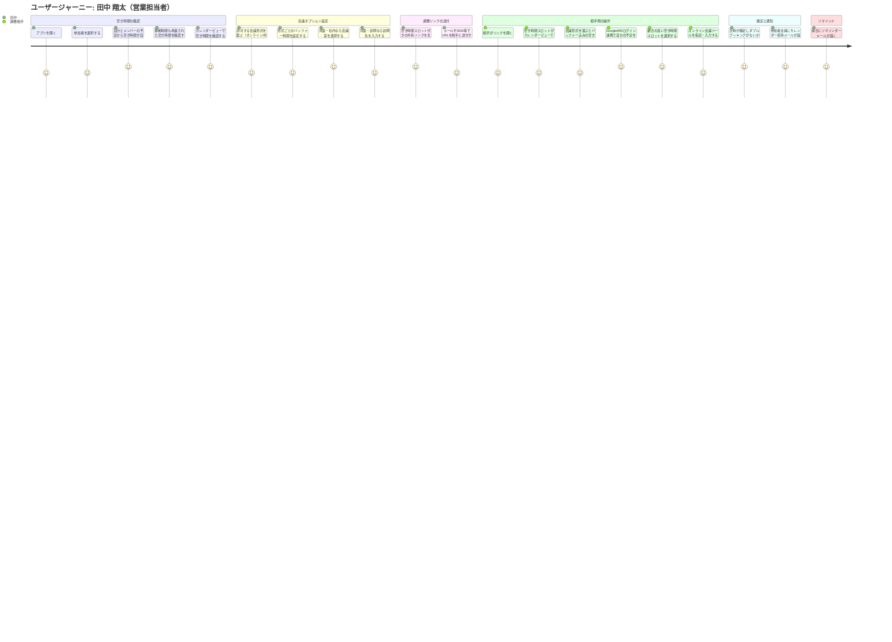

# ユーザージャーニー

## ペルソナ

| 項目 | 内容 |
|-----|------|
| ペルソナ | 田中 翔太（営業担当者） |
| ユーザー像 | 30代中堅営業、毎日数件の予定調整が発生、社内外両方の相手と調整 |
| 課題 | グループ会社間の空き時間確認が困難、メール往復に時間がかかる、移動時間の考慮漏れ |
| 利用シーン | 社内会議・顧客打合せの日程調整、会議室予約・オンライン会議設定 |

## ジャーニーマップ

## メインフロー

| # | フェーズ | 行動 | 課題・感情 | 解決 |
|---|---------|------|----------|------|
| 1 | 空き時間の確認 | 参加者を選択すると、自分とグループ会社メンバーの予定から移動時間も考慮した空き時間が自動抽出され、カレンダービューで表示される | 「グループ会社の相手の予定がわからない」「移動時間を考慮し忘れる」という不安 | ドメインが異なるメンバーの予定も統合し、移動時間込みの空き時間を自動で抽出・表示 |
| 2 | 会議オプション設定 | ゲストに許可する会議形式（オンライン/対面・社内/対面・訪問）を複数選択。形式ごとにバッファー時間を設定（訪問:60分等）。対面・社内なら会議室選択、訪問なら先方住所を入力 | 会議形式が事前に決まらないケースがある。移動時間の考慮漏れ | 複数形式を許可してゲストに選ばせる。形式別バッファーで移動時間も自動反映 |
| 3 | 調整リンクの送付 | 空き時間スロットが表示される共有リンクを生成し、メール・SNS等でURLを相手に送る | メールで候補日を何往復もやり取りする手間 | URLを1回送るだけで候補日時の共有が完了 |
| 4 | 相手側の操作 | 相手がリンクを開き、会議形式を選ぶとバッファー時間込みの空きスロットが表示される。Google/MSログイン連携（任意）で自分の予定もオーバーレイ表示され、都合の良いスロットを選択する。オンラインの場合は会議ツールを指定できる | 相手も自分の予定と見比べる手間がある。形式によって空き時間が変わる | 形式を選ぶとバッファー込みのスロットに動的更新。ログイン連携で予定を重ねて表示。ログインなしでも利用可能 |
| 5 | 確定と通知 | スロットが選択されるとダブルブッキングがないか自動チェックされ、日時が確定。参加者全員にカレンダー招待メールが自動送信される | 確定後の連絡漏れ、ダブルブッキングのリスク | ダブルブッキング自動検知＋カレンダー招待自動送信で漏れもダブりもない |
| 6 | リマインド | 会議前日にリマインダーメールが参加者全員に届く | 予定を忘れてしまうリスク | 前日に自動リマインドで予定忘れを防止 |

## 感情の変化

- **開始時**: 「また面倒な予定調整か...」（ため息）
- **空き時間自動抽出時**: 「移動時間も含めて空きがわかる！ダブルブッキングの心配がない」（驚き・安心）
- **会議オプション設定時**: 「形式を複数許可しておけば相手に選んでもらえる、移動時間のバッファーも設定できて安心」（満足）
- **リンク送付時**: 「URLを送るだけでいいのか、メールの往復が不要だ」（満足）
- **相手が選択・確定時**: 「相手が選んだら自動で招待が飛ぶ、ダブルブッキングチェックも安心」（達成感）
- **リマインド受信時**: 「前日に通知が来るので安心、予定を忘れることがない」（安心感）
