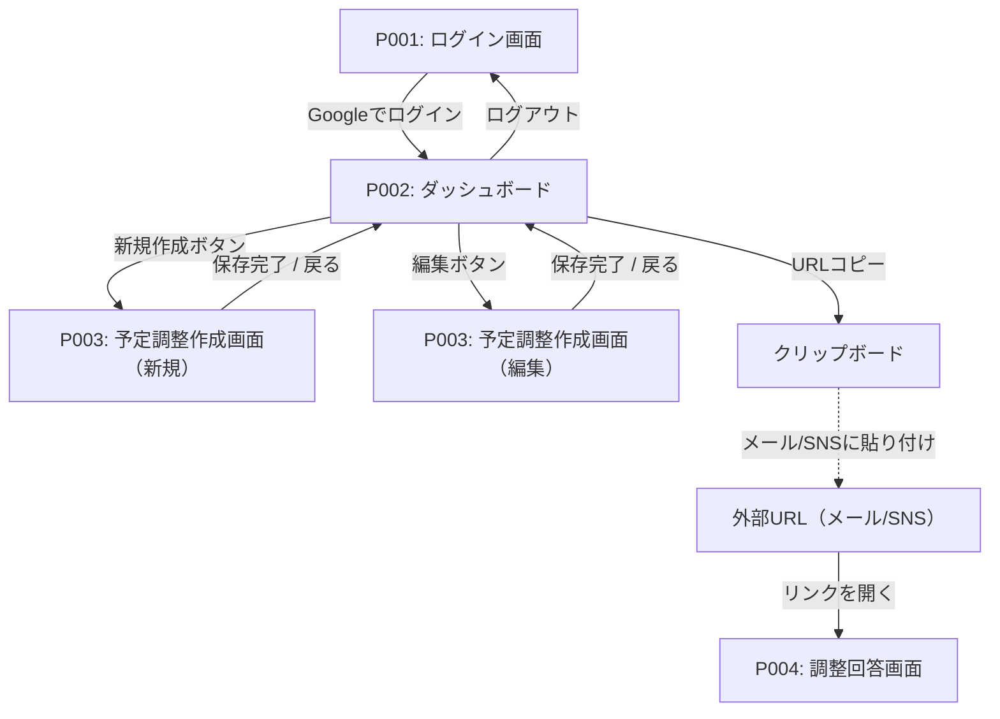

# 画面フロー・遷移図

## 概要
| 項目 | 内容 |
|------|------|
| プロジェクト | BoostCal |
| Sprint | Sprint 1 |
| 作成日 | 2026-04-08 |

## ページリスト（確定版）

| ページID | ページ名 | 説明 |
|---------|---------|------|
| P001 | ログイン画面 | Google OAuthでのログイン（ドメイン制限あり） |
| P002 | ダッシュボード | スケジュールリンク一覧の表示・管理 |
| P003 | 予定調整作成画面 | リンクの新規作成・編集（参加者選択・空き時間設定・会議オプション） |
| P004 | 調整回答画面 | ゲストが空き時間スロットを確認・予約する（認証不要） |

## ページ関係表

| ページ名 | 説明 | 遷移元 | 遷移先 | 遷移トリガー |
|--------|------|--------|--------|------------|
| P001: ログイン画面 | Google OAuthログイン | - | P002 | Googleでログインボタン → OAuth完了 |
| P002: ダッシュボード | リンク一覧・管理 | P001, P003 | P001, P003 | 新規作成ボタン→P003、編集ボタン→P003、ログアウト→P001 |
| P003: 予定調整作成画面 | リンク作成・編集 | P002 | P002 | 保存完了→P002、戻るボタン→P002 |
| P004: 調整回答画面 | ゲスト予約ページ | 外部（共有URL） | - | メール/SNSで受け取ったURLからアクセス |

## ページ遷移図

## 補助ページ（画面遷移図外）

| ページ | パス | 認証 | 説明 |
|-------|------|------|------|
| カレンダー連携受諾ページ | `/invite/:token` | 不要 | 外部ユーザーが招待リンクを開くと表示。Googleログインしてカレンダーアクセスを許可する専用ページ。完了後は「連携が完了しました」メッセージを表示 |

## 画面外の処理（バックエンド）

| 処理 | トリガー | 説明 |
|------|---------|------|
| リマインダーメール送信 | 会議前日（バッチ処理） | 確定済みの予約について、前日に参加者全員へリマインダーメールを自動送信する |
| カレンダー招待メール送信 | 予約確定時（P004） | 予約確定と同時に参加者全員へカレンダー招待メールを送信する |

## 補足

- P004（調整回答画面）は認証不要の公開ページであり、社内ユーザーのフローとは独立している
- P002のURLコピー機能で取得したURLを、ユーザーがメール・SNS等に貼り付けてゲストに共有する
- P003は新規作成と編集で同じ画面を使用し、URLパラメータで切り替える
- リマインダーメールは画面操作ではなくバックエンドのバッチ処理として実行される
- 各Pageの詳細仕様は `specifications/{page-name}.md` を参照
